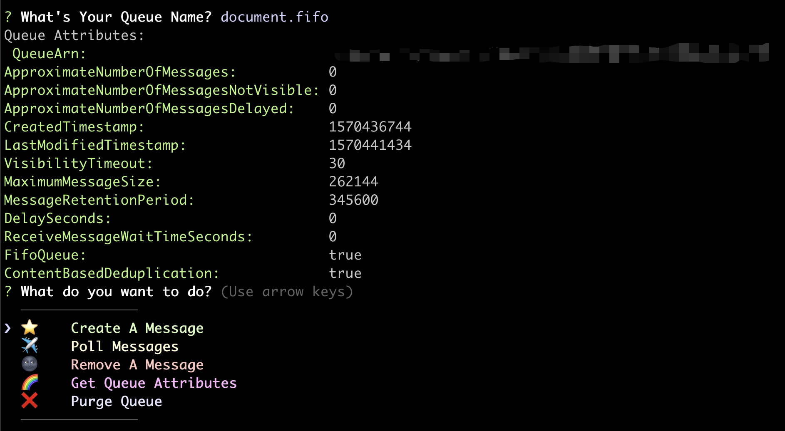

# AWS SQS Tutorial

This project is aimed at the beginner of using AWS SQS service.

It's a pretty _command-line_ program to **send/receive/delete** SQS messages using javascript **aws-sdk**

## Usage

Clone this repo and run `npm start`

Follow the command-line hint:

- Type in your queue name
- Select the action you want
- Have fun!

## Use Globally

Run `npm link` to link current package to global package. Then run `aws-sqs-cli` in the command-line

## Develop

1. Run `npm run dev`. Program is waiting for debugger to connect to `localhost:9229`
2. Open your favorite debug tool to remote debug with `localhost:9229`

## Publish

Using GitHub Action to publish this `aws-sqs-cli` package. It's configured to automatic publish package with `v*` tag matches.

- Update package version using `npm version v1.0.0`
- `git push`
